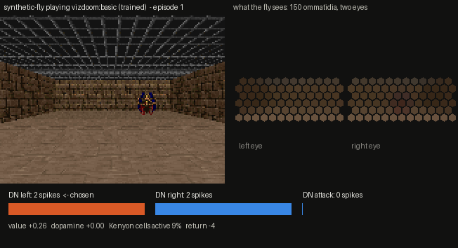

# flydoom: a fruit-fly brain learns to play Doom, and a test engine checks that it really learned

A spiking model of the *Drosophila* brain looks at classic Doom through two compound eyes,
decides with its descending neurons, and learns from dopamine. A test engine around it
runs every claim through falsifiable gates: statistics on fixed evaluation seeds, lesion
controls, and fly-style conditioning experiments.



*Left: the game (Freedoom assets via ViZDoom). Right: what the fly sees, one hexagon per
ommatidium. Bottom: spikes of the descending-neuron groups that vote for each Doom button.*

> **What this is not:** this is not AGI. It is ~2,000 spiking neurons (or the real
> 139k-neuron FlyWire connectome) learning a narrow visuomotor skill. The point of the
> engine is to tell real learning apart from luck, overfitting to seeds, or wiring artefacts.

## Results

All numbers below come from `python -m flydoom run ...` and are in [`results/`](results/)
(each folder has an interactive `report.html`, `report.md`, `results.json`, `replay.gif`
and the learned `weights.npz`). Evaluation uses frozen weights on 50 fixed episode seeds
that the brain never trained on. Every condition is scored on the same seeds.

### Synthetic fly brain on real Doom (`vizdoom:basic`, 300 training episodes)

| seed | scripted aimer (cheats) | random play | untrained brain | **trained brain** | trained, Kenyon cells silenced | trained with dopamine neurons silenced | gates passed |
|---|---:|---:|---:|---:|---:|---:|---:|
| 0 | +73.2 (100%) | -134.5 (66%) | -103.4 (74%) | **+36.7 (98%)** | -149.6 (60%) | -100.2 (74%) | 6 / 6 |
| 1 | +73.2 (100%) | -177.5 (54%) | -134.4 (62%) | **+49.9 (100%)** | -175.2 (60%) | -200.3 (48%) | 6 / 6 |
| 2 | +73.2 (100%) | -155.0 (58%) | -133.5 (66%) | **-5.2 (88%)** | -147.3 (64%) | -155.0 (56%) | 6 / 6 |

Mean episode return; in brackets, the share of episodes in which the monster was killed.
The scripted aimer is a reference ceiling that reads the true monster positions from the
game engine, which the fly never gets. In ViZDoom `basic` a kill gives +100, each tic costs -1 and each missed shot -5; the
episode times out after 300 tics (-300 without a kill).

Where the trained fly steers (seed 0, share of actions by the monster's true azimuth,
which the brain never sees):

| monster azimuth | < -20° | -20…-10° | -10…-3° | -3…3° | 3…10° | 10…20° | > 20° |
|---|---:|---:|---:|---:|---:|---:|---:|
| move left | 57% | 66% | 50% | 21% | 11% | 23% | 34% |
| move right | 13% | 10% | 16% | 14% | 48% | 46% | 37% |
| attack | 30% | 24% | 34% | **65%** | 41% | 30% | 29% |

Untrained, every row is about a third each. The fly learned to strafe toward the monster
and fire when it is centred.

### Synthetic fly brain on `vizdoom:defend_the_center` (200 training episodes, seed 0)

Monsters walk in from all sides, the fly can only turn and shoot, +1 per kill, -1 for dying.

| scripted aimer (cheats) | random play | untrained | **trained** | Kenyon cells silenced | dopamine neurons silenced | gates passed |
|---:|---:|---:|---:|---:|---:|---:|
| +10.2 | +0.5 | +0.3 | **+3.9** | +0.7 | +0.4 | 6 / 6 |

The trained fly learned a simple strategy: sweep left and fire when a monster is centred.
It fires in 63% of steps with a centred monster versus about a third untrained. It still
also turns left for monsters on the right, which is why it reaches about 40% of the
cheating aimer's score.

### Dependency-free MiniDoom self-test (`python -m flydoom selftest`)

Trained -0.8 versus -177 untrained and -220 random play. G1-G4 and G6 pass. G5 (aiming)
**fails**: the trained fly kills in 87% of episodes, but with a rightward bias rather than
by steering toward the monster, and the gate flags exactly that.

RESULTS_FLYWIRE_PLACEHOLDER

## How it works

```
Doom frame (ViZDoom + Freedoom, 160x120 RGB, one brain decision per 4 game tics)
  │
  ▼  compound eyes: 2 hexagonal lattices, 150 ommatidia, 4.5° spacing, Gaussian acceptance
  │  R1-6 luminance + R7/R8-like short-vs-middle wavelength opponency (flies have no red cone)
  ▼
optic lobe (graded, not spiking): ON/OFF transients, centre-surround contrast, colour contrast,
  │  T4/T5 Hassenstein-Reichardt motion, figure (relative motion), small-object (LC10a/LC11),
  │  looming (LC4/LPLC2); wide-field suppression + contrast gain control
  ▼
visual projection neurons (VPNs) ── Poisson spike trains ────────────────────────────┐
  │ 6 random "claws" per Kenyon cell                                                  │
  ▼                                                                                   │ leaky integrate-and-fire,
Kenyon cells (1,500) ◄──► APL feedback inhibition (keeps ~5-10% of KCs active)        │ Shiu et al. 2024 whole-
  │ plastic                                      │ plastic                            │ brain parameters, exact
  ▼                                              ▼                                    │ exponential integration,
actor MBONs (one group per motor primitive)   critic MBONs: appetitive / aversive     │ 1.8 ms synaptic delay
  │                                              │ value V = drive(+) - drive(-)      │
  ▼                                              ▼                                    │
descending neurons ◄─► LAL mutual inhibition   prediction error δ = r + γV(s') - V(s) │
  │ the group with most spikes presses its button     │                               │
  ▼                                                   ▼                               │
MOVE_LEFT / MOVE_RIGHT / TURN_* / ATTACK      PAM (δ>0) or PPL1 (δ<0) dopamine burst ─┘
                                              their spike counts = the third factor
```

**Neurons.** Every neuron is the leaky integrate-and-fire model that Shiu et al. (2024) ran on
the whole FlyWire brain: `v_rest = v_reset = -52 mV`, `v_th = -45 mV`, `τ_m = 20 ms`,
`τ_syn = 5 ms`, refractory 2.2 ms, delay 1.8 ms, `w_syn = 0.275 mV` per synapse, Poisson drive
`= 68.75 mV` kicks ([`flydoom/brain/lif.py`](flydoom/brain/lif.py)). The membrane is integrated
exactly between spikes, so a 0.5 ms step reproduces the analytic post-synaptic potential
(tested at 0.1-1 ms). Spikes are propagated only along the CSR rows of neurons that fired,
so the full 138,639-neuron, 15-million-edge connectome runs at about 1.4 ms per step in numpy.

**Learning** ([`flydoom/brain/plasticity.py`](flydoom/brain/plasticity.py)) happens where the
fly does it: at Kenyon cell → MBON synapses, gated by dopamine. Each synapse keeps an
eligibility trace (Kenyon-cell activity × whether its MBON's action was chosen). A
dopamine burst then rewrites it. The burst is the reward prediction error, delivered as
Poisson drive to PAM (better than expected) or PPL1 (worse) neurons, and decoded back
from their spikes. That makes it actor-critic TD(λ) written as a three-factor rule.
Silencing the dopamine neurons removes the third factor, and with it all learning.

**Calibration.** Before training, the brain watches 200 frames of random play: the VPN
contrast gain adapts to the scene and KC → MBON weights are scaled so that MBONs sit just
below threshold. Learning rates are relative to that reference weight. The same settings
therefore work across scenarios and brain sizes.

## The test engine

`python -m flydoom run` executes one protocol and writes the report:

1. build the brain, calibrate it, and evaluate the **untrained** brain and a **random policy** on fixed seeds;
2. **train** with plasticity on (separate seeds), then evaluate the frozen **trained** brain;
3. **lesion controls**: silence the Kenyon cells of the trained brain, and train a twin brain whose dopamine neurons are silenced;
4. **aversive visual conditioning** (the fly's classic Tully-Quinn paradigm, with vision instead of odour);
5. score the gates and write `report.html` / `report.md` / `results.json` / `replay.gif` / `weights.npz`.

| gate | passes when |
|---|---|
| G1 learning | trained > untrained **and** trained > random (one-sided Mann-Whitney, p < 0.01, same seeds) |
| G2 learning curve | Spearman ρ(episode, return) > 0 with p < 0.01, and last third > first third |
| G3 dopamine necessity | a brain trained with silenced PAM/PPL1 neurons is no better than untrained (p > 0.05) and loses to the intact trained brain (p < 0.01) |
| G4 mushroom-body necessity | silencing Kenyon cells after training degrades play (p < 0.01) |
| G5 visual aiming | P(left \| monster left) > P(left \| monster right) and vice versa, and more firing when the monster is centred (Fisher exact, p < 0.01). The untrained brain is reported as a control. |
| G6 aversive conditioning | after CS+ × punishment pairing, value(CS+) drops relative to value(CS-) (p < 0.01); no effect with dopamine neurons silenced |

For the real connectome, `python -m flydoom flywire-gates` adds stimulus-response checks on the
unmodified wiring (C1-C3, see below).

## Two brains

**`--brain synthetic` (default).** A procedurally generated brain wired after known fly
circuit motifs ([`flydoom/brain/synthetic.py`](flydoom/brain/synthetic.py)). VPNs feed
1,500 Kenyon cells with 6 random claws each. One APL pool provides feedback inhibition.
There are actor MBONs per motor primitive and appetitive/aversive critic MBONs, plus
descending-neuron groups with LAL-like mutual inhibition, 16 PAM and 16 PPL1 dopamine
neurons. That makes 1,936 neurons and ~166k synapses. It trains at about 0.25 s per Doom
episode.

**`--brain flywire`.** The real adult fly brain: FlyWire v783 (Dorkenwald et al. 2024), using
the tables Shiu et al. published, with FlyWire's cell-type annotations (Schlegel et al. 2024)
([`flydoom/brain/flywire.py`](flydoom/brain/flywire.py)). `python -m flydoom fetch-flywire`
downloads them, about 140 MB. Vision is injected into the real LC/LPLC lobula columnar
neurons by their known tuning: LC4/LPLC2/LC6/LC16 for looming, LC10a/LC11/LC18 for small
objects, and so on. It also drives the mushroom-body visual inputs (aMe12, MTe30/32, LTe25)
and the HS/H2 tangential cells. The teaching signal goes into the real 307 PAM and 16
PPL1 dopamine neurons. The 1,299 real descending neurons are read out by a small,
non-connectome "VNC" layer. That layer has innate inputs from the DNs with known motor
roles (DNa01/DNa02 steering, DNp09 forward, MDN backward, giant fibre DNp01 → attack) and
plastic, dopamine-gated inputs from all DNs. `--region central` (default) keeps the
50,527 central-brain and visual-projection neurons; `--region full` keeps all 138,639.

## Quick start

```bash
cd flybrain-doom
pip install -e ".[doom,flywire,dev]"      # numpy, scipy, vizdoom (bundles Freedoom), pandas, pyarrow, pytest

python -m flydoom info                    # what is installed
python -m pytest                          # unit tests (~10 s)
python -m flydoom selftest                # end-to-end battery on MiniDoom, no ViZDoom needed (~3 min)

python -m flydoom run --env vizdoom:basic --train 300 --eval 50          # ~6 min, writes results/...
python -m flydoom run --env vizdoom:defend_the_center --train 200 --eval 30
python -m flydoom replay --results results/vizdoom-basic-synthetic-seed0 # GIF from saved weights

python -m flydoom fetch-flywire --dest data                              # the real connectome
python -m flydoom flywire-gates --full --flywire-dir data/Drosophila_brain_model \
    --annotations data/flywire_annotations/supplemental_files/Supplemental_file1_neuron_annotations.tsv
python -m flydoom run --brain flywire --env vizdoom:basic --train 150 --eval 30 \
    --flywire-dir data/Drosophila_brain_model \
    --annotations data/flywire_annotations/supplemental_files/Supplemental_file1_neuron_annotations.tsv
```

Environments: `vizdoom:basic`, `vizdoom:defend_the_center`, `vizdoom:defend_the_line`,
`vizdoom:health_gathering`, `vizdoom:take_cover`, `vizdoom:deadly_corridor`, and the
dependency-free `minidoom:basic` / `minidoom:defend` raycaster used by the tests.

## Code map

```
flydoom/
  brain/connectome.py   neurons, signed edges, named groups, plastic edge sets, CSR compile
  brain/lif.py          Shiu et al. LIF simulator (exact propagator, delays, Poisson drive, silencing)
  brain/synthetic.py    procedural fly-like brain (VPN -> KC/APL -> MBON -> DN, PAM/PPL1)
  brain/flywire.py      FlyWire v783 loader, VPN/DAN/DN mapping, VNC readout, connectome gates C1-C3
  brain/plasticity.py   dopamine-gated three-factor actor-critic plasticity
  senses/eye.py         two hexagonal compound eyes with Gaussian acceptance
  senses/optic_lobe.py  graded optic-lobe feature channels
  senses/vpn.py         pooling into visual projection neuron rates, gain control
  agents/fly_agent.py   the perception -> dopamine -> action loop, calibration, conditioning
  envs/vizdoom_env.py   real Doom scenarios through ViZDoom
  envs/minidoom.py      tiny numpy raycaster with basic/defend scenarios
  engine/               runner, statistics, gates, experiment protocol, HTML report, GIF replay
tests/                  pytest suite (LIF maths, wiring, senses, plasticity, envs, agent, engine)
results/                reports from the runs quoted above
```

## Background research

The idea is in the air. Three days after the MaleCNS v1.0 connectome of the adult male fly
(~166,700 neurons) was published, Alex Wormuth's **DOOMFLY** hooked it to Doom. Doom frames
stimulate photoreceptor inputs, DNp20 and DNpe017 activity is mapped to controls, and damage
triggers two PPL101 dopamine cells. Its README is admirably candid: the current candidate
"failed its visual, conditioning and survival validation gates". flydoom takes that seriously in four ways:

* **Learning claims are gated.** Each claim needs fixed evaluation seeds, baselines,
  significance tests, and lesion controls showing that the learning depends on dopamine
  and the mushroom body.
* **Vision is tested, not assumed.** In the Shiu et al. LIF model, photoreceptor drive dies
  in the medulla (gate C1). The optic lobe is graded, not spiking. So flydoom models the
  optic lobe functionally and injects vision at the visual projection neurons, where the
  real wiring does relay it (gates C2, C3).
* **The learner sits where flies learn.** It uses KC → MBON synapses, with a prediction-error
  dopamine signal and eligibility traces.
* **The result is reported either way.** For the real connectome, the engine shows how much
  task information survives to the descending neurons, whether or not that flatters the model.

## Limitations

* The synthetic brain is *fly-like*, not the fly: its wiring motifs come from the
  literature, but the connections are random. The real-connectome mode is the faithful one,
  and it does not (yet) learn Doom.
* The optic lobe is a functional model, not a simulation of its ~77k neurons.
  Connectome-constrained optic-lobe models (Lappalainen et al. 2024) would be the principled
  upgrade.
* The value estimate is read from the critic MBONs' synaptic drive rather than their noisy
  spike counts (`value_readout="spikes"` is available). The prediction error is computed,
  then delivered through the dopamine neurons. It is not generated by MBON → DAN wiring.
* MaleCNS v1.0 is not wired in yet: its download site was unreachable from the build
  environment. The `Connectome` API takes any signed edge list, so an adapter is a small
  addition.

## Sources

* Shiu et al. 2024, *A Drosophila computational brain model reveals sensorimotor processing*, Nature 634:210-219, <https://www.nature.com/articles/s41586-024-07763-9>; code and FlyWire v783 tables: <https://github.com/philshiu/Drosophila_brain_model>
* FlyWire annotations (Schlegel et al. 2024, *Whole-brain annotation and multi-connectome cell typing of Drosophila*, Nature): <https://github.com/flyconnectome/flywire_annotations>, <https://www.nature.com/articles/s41586-024-07686-5>
* DOOMFLY: <https://github.com/nftechie/doomfly>; announcement: <https://x.com/wormuth/status/2096409780961059119>
* News coverage: Tom's Hardware <https://www.tomshardware.com/software/programming/google-maps-entire-brain-and-central-nervous-system-of-adult-male-fruit-fly-software-engineers-immediately-make-it-run-doom-ai-powered-3d-model-of-over-166-000-neurons-can-also-play-super-mario-64>, Gizmodo <https://gizmodo.com/google-mapped-a-fruit-flys-brain-now-its-playing-doom-and-super-mario-64-2000808616>
* MaleCNS v1.0 connectome: <https://male-cns.janelia.org/>
* Eon Systems fly-brain emulation benchmarks: <https://github.com/eonsystemspbc/fly-brain>; interactive FlyWire LIF lab: <https://github.com/syn-ack-ai/fruit-fly-lab>
* ViZDoom scenarios: <https://vizdoom.farama.org/environments/default/>
* Circuit background used for the wiring and cell-type roles: Aso et al. 2014 (mushroom-body compartments); Hige et al. 2015 and Cohn et al. 2015 (dopamine-gated KC → MBON plasticity); Lin et al. 2014 (APL and sparse KC coding); Bennett et al. 2021 (prediction errors in a mushroom-body model); Rayshubskiy et al. 2020 (DNa01/DNa02 steering); Bidaye et al. 2014 (MDN) and 2020 (P9/DNp09 forward walking); von Reyn et al. 2014 and Ache et al. 2019 (LC4/LPLC2 → giant fibre); Keleş & Frye 2017 (LC11 small objects); Hassenstein & Reichardt 1956 (motion detector); Tully & Quinn 1985 (fly conditioning); Frémaux & Gerstner 2016 (three-factor rules).

Code: MIT. FlyWire data are downloaded by the user under their own terms and are not
redistributed here. ViZDoom and Freedoom keep their own licences.
