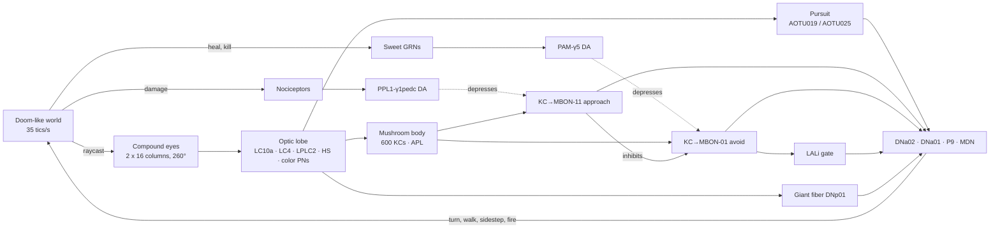

# Fly Brain Doom

A spiking model of the fruit fly brain plays a Doom-like shooter, and a test engine checks whether it actually **learns**, using the controls a fly lab would use.

Open `index.html` in a browser. It has three tabs:

- **Watch the fly** shows the game from the fly's position, what its compound eyes see, its circuit firing live, and what its mushroom body has learned. You can also take over the controls; the brain keeps watching and learning from what happens to you.
- **Test lab** runs controlled experiments in Web Workers and says which brains learned.
- **Wiring & method** lists every cell type, the model's parameters and its sources.

```sh
npm test                                   # 13 tests, ~2 s
node cli/run.mjs                           # full experiment battery (~5 min on 4 cores)
node cli/run.mjs --protocol quick          # 15-second smoke test
node cli/run.mjs --protocol learning --subjects 24 --seed 42 --workers 8
node cli/report.mjs results/learning.json  # re-analyze saved runs
node cli/build.mjs                         # rebuild index.html after editing src/ or web/
```

No dependencies; Node 20+.

## Why a test engine

In 2026 several projects wired fly connectomes to games ([DOOMFLY, fruitfly-lab and others](https://github.com/townie/awesome-fruit-fly)). They found the play is wiring reflex, and that "learned survival has not been demonstrated". [fruitfly-lab](https://github.com/webergithub/fruitfly-lab) set the bar for controls: a degree-preserving scrambled connectome, and lesions. This project builds on that. It asks a narrower, testable question: **does dopamine-driven learning in the fly's mushroom body change what it does in the game, and can we prove it?**

## The model



- **World** (`src/world.js`): grid walls, imps that chase and throw fireballs, a hitscan pistol, and blue and green orbs. One orb color heals (+10) and the other burns (−12). Which color heals is assigned per fly, so no fixed wiring can know it.
- **Eyes** (`src/eye.js`): 16 ommatidial columns per eye over 140°, with 20° of binocular overlap. Rate-coded optic lobe outputs:
  - small-object detectors (LC10a), with size tuning that peaks near 10°;
  - looming detectors (LC4 for speed, LPLC2 for size) that cancel the fly's own walking;
  - horizontal optic flow from Reichardt correlators (HS);
  - color channels to the mushroom body that respond mostly to nearby objects;
  - wall contact (MECH, ahead and behind).
- **Brain** (`src/connectome.js`, `src/brain.js`): 862 neurons and 9,078 connections (~199k synapses). It uses leaky integrate-and-fire neurons with the parameters of [Shiu et al. 2024](https://www.nature.com/articles/s41586-024-07763-9): rest −52 mV, threshold −45 mV, τm 20 ms, τsyn 5 ms, 2.2 ms refractory, 0.275 mV per synapse and a 1.8 ms delay, simulated at 0.5 ms steps. Synapse signs follow the transmitter.
- **Innate behavior**:
  - **Pursuit.** LC10a → AOTU019 (GABA, central field, contralateral) and AOTU025 (ACh, peripheral, ipsilateral) → DNa02/DNa01 steer toward small objects. This follows the courtship-pursuit pathway that fruitfly-lab extracted from FlyWire.
  - **Firing.** The gun fires when both AOTU019 populations are active, which means the target is in the binocular zone.
  - **Escape.** Looming drives the giant fiber, which sidesteps away.
- **Learning**:
  - **Input.** Color projection neurons feed 600 Kenyon cells through random 6-claw wiring that differs per fly. The APL neuron keeps the code sparse.
  - **Plasticity.** The KC → MBON synapses use a three-factor rule: KC eligibility trace × dopamine → depression ([Hige et al. 2015](https://www.cell.com/neuron/fulltext/S0896-6273(15)00982-4)). Dopamine onto a silent KC's synapse lets it recover, and every synapse drifts slowly back to baseline.
  - **Teaching signals.** Damage drives PPL1-γ1pedc, which depresses KC→MBON-11 (approach). Healing and kills drive PAM-γ5, which depresses KC→MBON-01 (avoidance). MBON-11 inhibits MBON-01, the feedforward motif described in [Gkanias et al. 2022](https://elifesciences.org/articles/75611).
  - **Output.** A punished color releases MBON-01. That turns the fly away, backs it off, and gates off pursuit through an inhibitory LAL interneuron.

### What it is not

- **Not the full connectome.** FlyWire has ~140k neurons and MaleCNS ~166.7k. This is a hand-built reduction to the named cell types and wiring motifs the game needs, with synapse counts tuned by calibration. Cell counts are scaled down.
- **Some links are modeling assumptions:**
  - MBON-01 is glutamatergic but excitatory here;
  - the LAL gating interneuron is generic;
  - the optic lobe is rate filters, not spiking;
  - MBON outputs reach descending neurons more directly than in a real fly.
- **Not AGI.** A fly brain is a narrow, superbly tuned controller. The engine's job is to test learning claims properly, not to make broad ones.

## The test engine

`src/experiment.js` and `src/stats.js`; run with `cli/run.mjs` or the Test lab tab.

- **Subjects.** Each fly has its own Kenyon-cell wiring and noise seed.
- **Counterbalancing.** Even-numbered flies are healed by blue and odd-numbered flies by green, so innate color bias cancels in the group mean.
- **Paired design.** Every condition runs the same flies in the same worlds; only the manipulation differs.
- **Reversal.** After training, the colors swap meaning. A learner first shows its old memory and then re-learns; wiring alone cannot follow a swap.
- **Measure.** The preference index is PI = (healing − burning touches) / all touches, scored against whichever color heals at the time. Every orb touch is logged in order, so learning is visible encounter by encounter.
- **Inference.** Two-sided permutation tests (exact sign-flip for n ≤ 16), bootstrap CIs and Cohen's d. Verdicts:
  - **Learns:** late-training PI > 0 at p < 0.05.
  - **Learns and re-learns:** also, the PI over the first 4 touches after the swap falls below the trained level (paired, p < 0.05) and recovers above 0 by the end (p < 0.05).

| Condition | Manipulation |
|---|---|
| Intact fly | full model |
| Dopamine blocked | PPL1 and PAM silenced (like TH-GAL4 > Kir2.1) |
| Kenyon cells blocked | all KCs silenced (like MB247 > shibire) |
| Scrambled wiring | every synapse rewired, keeping each neuron's in/out degree and transmitter |
| LC10a lesion | small-object detectors silenced |
| Random policy | no brain |

## Results

Full report: [`results/REPORT.md`](results/REPORT.md). The numbers below come from base seed 1: 16 flies per condition, 12 training episodes then 6 reversal episodes, 40 s each.

**Valence learning: the intact fly learns and re-learns; nothing else does.**

| Condition | First 4 touches | Late training PI | First 4 touches after swap | End of reversal | Verdict |
|---|---|---|---|---|---|
| Intact fly | +0.25 ± 0.06 | **+0.29 ± 0.04** (p<0.001) | **−0.31 ± 0.11** | **+0.36 ± 0.04** (p<0.001) | Learns and re-learns |
| Dopamine blocked | +0.00 ± 0.10 | −0.02 ± 0.03 (p=0.57) | +0.00 ± 0.12 | +0.07 ± 0.03 | No evidence of learning |
| Kenyon cells blocked | +0.03 ± 0.11 | +0.03 ± 0.03 (p=0.21) | −0.09 ± 0.13 | +0.03 ± 0.03 | No evidence of learning |
| Scrambled wiring | −0.01 ± 0.20 | +0.10 ± 0.15 (p=0.61) | +0.00 ± 0.25 | −0.08 ± 0.18 | No evidence of learning |
| Random policy | +0.16 ± 0.11 | +0.02 ± 0.18 (p=0.91) | +0.00 ± 0.11 | +0.17 ± 0.14 | No evidence of learning |

- **Learning is real.** Intact minus dopamine-blocked is +0.30 ± 0.03 late PI (paired p<0.001, d = 2.15). Intact minus KC-blocked is +0.25 ± 0.05 (p<0.001).
- **Learning is fast.** The first 4 touches already favor the healing color, because one burn is enough to start avoiding a color. That fits flies, which form aversive memories in a single trial.
- **The reversal is the strongest evidence.** Right after the swap the intact fly goes for its *old* color (PI −0.31), then re-learns. Fixed wiring cannot produce that pattern.
- **Scrambled and random brains barely forage** (under 1.5 orbs per episode), so their PIs are noisy and their comparisons with intact are underpowered (p≈0.17–0.19).
- **One secondary result crosses p < 0.05 by chance.** The dopamine-blocked control's end-of-reversal PI (+0.07, p=0.02) does, which is expected with this many tests. The verdict rests on the pre-registered primary measures.

**Combat: the circuit can fight, and learning makes it stop.**

| Condition | Kills/episode | Accuracy | Damage/episode |
|---|---|---|---|
| Intact fly | 0.24 | 58% | 89 |
| Dopamine blocked (pure reflex) | **1.97** | **71%** | 89 |
| LC10a lesion | 0.00 | 0% | 89 |
| Scrambled wiring | 0.07 | 29% | 93 |
| Random policy | 0.10 | 4% | 93 |

The reflexive pursuit circuit aims and shoots: 2 kills per episode at 71% accuracy. Lesioning LC10a or scrambling the wiring abolishes that, so the wiring is the skill. With learning switched on, being hurt by imps teaches the mushroom body that imps are aversive. The fly then turns away and stops shooting (−1.94 kills/episode vs dopamine-blocked, p=0.001), **without taking any less damage**. So the learning is real but does not help it win, which is a useful reminder that "learns" and "plays better" are different claims.

## Files

```
src/rng.js         seeded RNG
src/maps.js        level layouts
src/world.js       Doom-like world simulation (headless)
src/eye.js         compound eyes + optic lobe
src/connectome.js  cell types, wiring, scramble control
src/brain.js       LIF simulator + dopamine-gated plasticity
src/agent.js       fly agent (eye -> brain -> actions), random agent
src/stats.js       permutation tests, t-tests, bootstrap
src/experiment.js  conditions, protocols, analysis, verdicts, report
cli/run.mjs        parallel experiment runner
cli/report.mjs     re-analyze saved results
cli/build.mjs      bundle everything into index.html
web/               renderer, app, page template
test/              node:test suite
results/           REPORT.md and the reference analysis shown in the app
```

## Sources

- Shiu et al. 2024, [A Drosophila computational brain model reveals sensorimotor processing](https://www.nature.com/articles/s41586-024-07763-9), Nature 634:210
- Aso et al. 2014, [Mushroom body output neurons encode valence and guide memory-based action selection](https://elifesciences.org/articles/04580), eLife
- Gkanias et al. 2022, [An incentive circuit for memory dynamics in the mushroom body](https://elifesciences.org/articles/75611), eLife
- Hige et al. 2015, [Heterosynaptic plasticity underlies aversive olfactory learning in Drosophila](https://www.cell.com/neuron/fulltext/S0896-6273(15)00982-4), Neuron
- Ache et al. 2019, [Neural basis for looming size and velocity encoding in the giant fiber escape pathway](https://www.janelia.org/publication/neural-basis-for-looming-size-and-velocity-encoding-in-the-drosophila-giant-fiber-escape), Curr Biol
- Kempka et al. 2016, [ViZDoom: a Doom-based AI research platform for visual reinforcement learning](https://arxiv.org/abs/1605.02097)
- [fruitfly-lab](https://github.com/webergithub/fruitfly-lab) and [awesome-fruit-fly](https://github.com/townie/awesome-fruit-fly) (DOOMFLY and related connectome-game projects)
