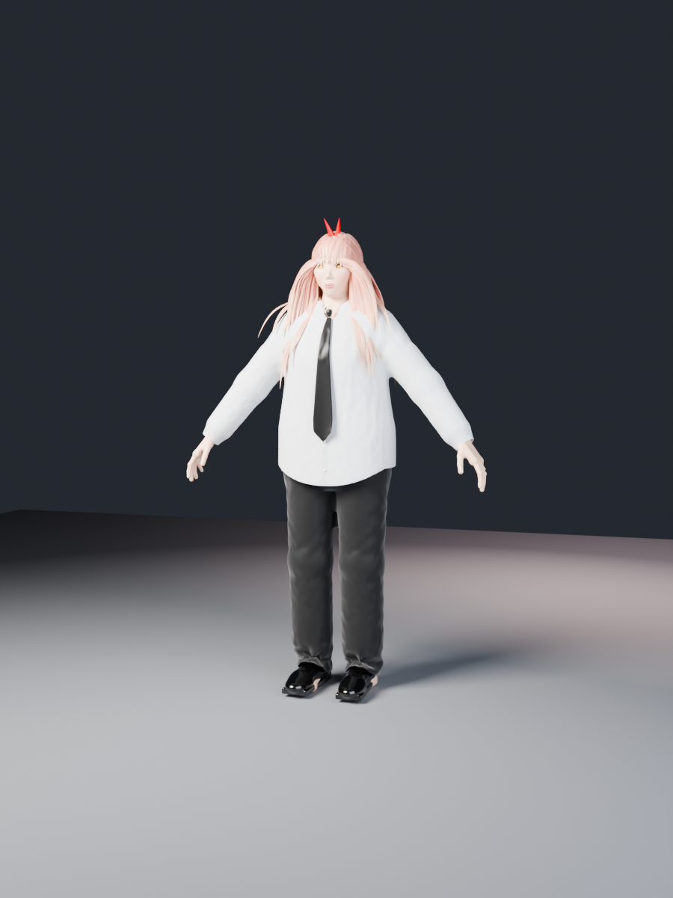
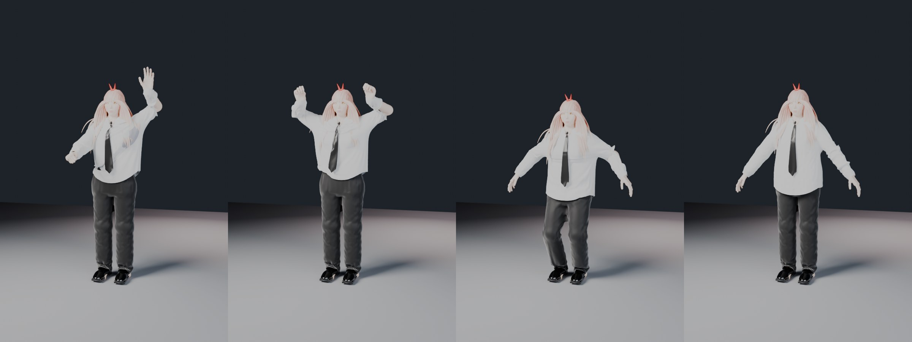

# Power (Chainsaw Man): rigged Blender character with cloth physics

**Download `Power_ChainsawMan.blend`, open it in Blender 4.2 or newer and press <kbd>Space</kbd>.**

| | |
|---|---|
|  |  |



## What's in the file

| Part | Details |
|---|---|
| **Body** | Sculpted female anatomy, about 1.65 m tall, ~110k verts: clavicles, breasts, ribcage, waist, hips/glutes, thigh, calf and arm muscles, knees and ankles, hands with 5 fingers and nails. Skin shader has subsurface scattering, blush, lips and nails. A modest underwear layer is painted on the body for when the clothes are hidden. |
| **Head** | Power's yellow-orange eyes with the **red cross-hair pupils**, eyelids, lashes, thin brows, her little **fang**, ears. |
| **Hair & horns** | Long, peachy-pink blonde hair (~310 clumps): messy bangs, a strand between the eyes, locks framing the face, back hair down to mid-back. Two red **horns**. |
| **Shirt** (cloth sim) | Loose white cotton shirt with collar, open top button, button placket (buttons ride on the cloth), stitched hem and cuffs, woven-fabric shader. |
| **Necktie** (cloth sim) | Black tie. The knot is rigid and the blade swings and collides with the shirt. |
| **Trousers** (cloth sim) | Loose black trousers with side seams, front creases and stitched hems, plus a leather belt with a metal buckle. |
| **Shoes** | Black leather shoes. They are collision objects, so the trouser hems pile on them. |
| **Rig** | Armature with IK arms and legs, elbow and knee pole targets, FK spine, neck and head, and 3-bone fingers. |

The clothes are real cloth simulations. They collide with the body, the shoes and the floor, and the shirt also collides with the trousers and belt. They are pinned only where real clothes are held (collar and shoulder yoke, buttoned cuffs, the waistband under the belt). The rest of the fabric is free, with only a whisper of pull back toward its hanging shape, so it sags, swings and folds like a rag. Raise an arm and the shirt rides up; lower it and the shirt falls back over the belt. The file opens with the clothes already settled under gravity.

## Hand controls

1. Click the rig (the coloured control shapes) and switch to **Pose Mode** (<kbd>Ctrl</kbd>+<kbd>Tab</kbd>).
2. The **paddle-shaped controls at the wrists** are `IK_hand.L` and `IK_hand.R`:
   * <kbd>G</kbd> moves the hand, and the whole arm follows (IK).
   * <kbd>R</kbd> rotates the hand.
   * The small spheres behind the elbows (`pole_arm.L/R`) aim the elbows.
3. With a hand control selected, open the **N panel → Item → Properties**
   (the demo action animates these too, so unlink `Power_Demo` first, see below):
   * **grip**: 0 = open hand, 1 = fist (all 15 finger joints curl).
   * **spread**: fans the fingers.
4. Feet: `IK_foot.L/R` (boxes) and `pole_leg.L/R` (spheres in front of the knees).
   Rotate the circles along the spine to bend the torso, neck and head. Move `hips` down to crouch.

## Physics

* Press <kbd>Space</kbd>. A built-in demo action (**Power_Demo**: wave, grab, arms up, small squat) shows the cloth swinging, sagging and folding.
* **Live posing:** in the *Action Editor*, unlink the `Power_Demo` action (the ✕ button), press <kbd>Space</kbd>, then grab a hand control with <kbd>G</kbd> *while it plays*. The sleeves and shirt react in real time.
* If the cloth looks wrong after editing, jump to **frame 1**. That resets the simulation cache.
* The simulation is computed live, so playback is slower than real time (roughly 1–2 frames per second on a 4-core CPU). Bake it (see below) for smooth playback.
* **Tweaking:** shirt/trousers → *Physics* tab → Cloth.
  * Lower *Bending* → floppier, more rag-like fabric. Higher → stiffer.
  * *Shape → Pin Group*: the `pin` vertex group. Weight 1 glues fabric to the body. Lower weights are soft "goal" springs: Blender uses weight⁴, so 0.4 is barely felt and 0.7 is a gentle pull. *Pin Stiffness* scales all the soft weights.
  * Bake the cache (*Cache → Bake*) before rendering an animation.

To keep the collisions stable when you pose quickly, the body collides through a hidden low-poly proxy, `Collision_Body` in the Physics collection. It is skinned to the same rig and one-sided, so fabric that gets pushed inside is pushed back out. `Collision_WaistGuard` is a hidden sloped collar over the waistband that stops the shirt hem from slipping into the trousers.

## Rendering

Eevee is set as the render engine (three-light studio setup, camera ready). Cycles works too: switch the engine and render.
The `Widgets` collection only holds the control shapes; leave it hidden.

## Rebuilding from source

Everything is generated procedurally by the scripts in this folder (no external assets):

```
blender --background --python build_power.py -- --out Power_ChainsawMan.blend
```

| File | Purpose |
|---|---|
| `build_power.py` | builds the scene: meshes, materials, rig, skinning, cloth, demo animation |
| `sdf_core.py` | signed-distance-field primitives plus a block-based Surface Nets mesher (pure numpy) |
| `anatomy.py` | body, head and hand sculpt as smooth SDF shapes, plus the skeleton landmarks |
| `garments.py` | shirt/trouser/shoe shells and their cut lines |
| `hair.py` | hair-clump growth (follows the scalp, falls under gravity, collides with the body) and the horns |
| `textures.py` | the cross-hair eye texture |

Optional flags: `--h 0.00125` (sculpt voxel size), `--tris 220000` (body triangle budget), `--drape 60` (settle frames), `--no-anim`.
A full build takes about 4–5 minutes on 4 CPU cores.

*Fan-made model of Power from Tatsuki Fujimoto's* Chainsaw Man *for personal and educational use.*
