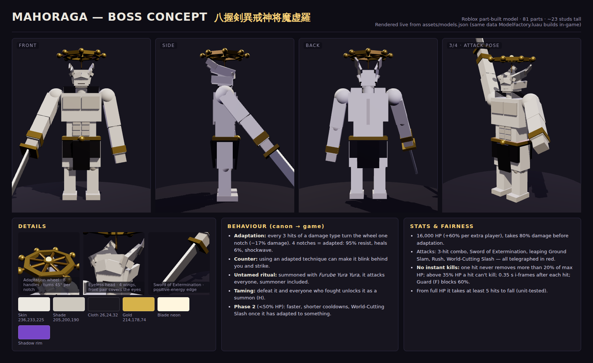

# Ten Shadows × Mahoraga — Roblox Studio project

A Jujutsu Kaisen fan project for Roblox Studio (Luau): the full **Ten Shadows Technique** (十種影法術),
the **Furube Yura Yura** summoning chant (the "Dabura Karaba" chant) and a **Mahoraga** raid boss that adapts to your techniques.



| | |
|---|---|
| Trailer (50 s) | [`media/trailer.mp4`](media/trailer.mp4) · short clip: [`media/trailer.gif`](media/trailer.gif) |
| Asset renders | [`media/assets_sheet.png`](media/assets_sheet.png), one image per model in [`media/assets/`](media/assets) |
| Effect stills | [`media/vfx_sheet.png`](media/vfx_sheet.png) |

> **About the pictures and video.** They are rendered with three.js (`preview/`) from the **same part data**
> the game builds in Roblox (`assets/models.json`), with the effects recreated shot for shot and the HUD layout of
> the in-game UI. They were **not** captured in Roblox Studio: Studio can't run in the Linux container this
> project was built in. Roblox's lighting, particles and fonts will look somewhat different.

## Play it

**Option A: open the place file**
1. Open `TenShadows.rbxlx` in Roblox Studio (File → Open from File).
2. Press **Play**. The arena builds itself, 3 training curses spawn, and Mahoraga rises from the altar about 15 s later.
   You can also summon it yourself: hold **G**.

**Option B: Rojo**: `rojo serve` in this folder, then connect from the Rojo plugin (the `src/` tree uses Rojo naming).

## Controls

| Key | Technique | What it does |
|---|---|---|
| M1 | Shadow Blade 影刀 | 4-hit sword combo, the 4th hit knocks back |
| 1 | Divine Dogs 玉犬 | White + black dog maul the target, then stand guard |
| 2 | Nue 鵺 | Flies up, dives, lightning AoE + short stun |
| 3 | Toad 蝦蟇 | Tongue grabs and pulls the target (Mahoraga is only staggered) |
| 4 | Great Serpent 大蛇 | Erupts under the target and launches it |
| 5 | Max Elephant 満象 | Crashes down and floods a cone with water |
| 6 | Rabbit Escape 脱兎 | Rabbit swarm: Mahoraga chases the decoy, you get brief i-frames |
| 7 | Round Deer 円鹿 | Heals 35% over 3 s, −30% damage taken while active |
| 8 | Piercing Ox 貫牛 | Straight charge; the further it runs before impact, the harder it hits |
| 9 | Tiger Funeral 虎葬 | Pounce + 3 rending claws |
| 0 | Divine Dog: Totality 玉犬・渾 | **Locked** until one of your Divine Dogs is destroyed (canon); giant 5-hit mauling |
| Q | Shadow Travel 影移動 | Sink into your shadow and re-emerge at the cursor, with i-frames |
| R | Domain Expansion: Chimera Shadow Garden 嵌合暗翳庭 | 15 s: shadow floor, shadow shikigami keep striking enemies, enemies slowed, your cooldowns halved |
| T | Agito 顎吐 | Chimera shikigami fights for 10 s and heals you on every strike |
| hold G | Furube Yura Yura 布瑠部由良由良 | 1.5 s chant, summons Mahoraga **untamed**: it attacks everyone, summoner included |
| H | Divine General Mahoraga 八握剣異戒神将魔虚羅 | **Locked** until you beat Mahoraga; it then fights for you for 20 s (×2 damage to curses) |
| F (hold) | Guard | Blocks 60% of damage, slower movement |

## Mahoraga

* **Adaptation wheel**: every 3 hits of one damage type turn the wheel a notch (−17% damage from that type).
  After 4 notches it is **adapted**: 95% resistance, it heals 6%, sends out a shockwave and may blink behind you to counter
  whenever you use that type again. Adaptation is tracked per type (Claw, Lightning, Bite, Water, Pierce, Rend, Shadow…),
  and the boss bar shows the wheel's progress, so the way to win is to keep rotating techniques.
* **Stronger than a normal enemy**: 16,000 HP (+60% per extra player), takes only 80% damage, fast telegraphed attacks
  (3-hit combo, Sword of Extermination, leaping Ground Slam, Rush). **Phase 2** under 50% HP: it moves faster,
  attacks more often, and once it has adapted to something it can use the **World-Cutting Slash**.
* **No instant kills** (`DamageRules.luau`, unit-tested): a single hit never removes more than **20% of max HP**,
  while you're above 35% HP no single hit can kill you, and there are 0.35 s i-frames after each hit.
  From full HP it takes at least 5 hits to go down.
* **Taming**: defeat it and everyone who damaged it unlocks **H**. It comes back 60 s later.

Canon notes: the chant, the untamed ritual (it attacks the summoner too), the adaptation wheel, the Sword of
Extermination, Totality coming from a destroyed Divine Dog, Piercing Ox's distance-based power, Round Deer's
reverse cursed technique and Agito being a fusion of Nue, Great Serpent, Tiger Funeral and Round Deer all follow the manga.
Tiger Funeral's abilities are never shown in the manga, so its pounce is invented.

## Tuning

Every number is in `src/ReplicatedStorage/TenShadows/Config.luau`: cooldowns, damage, boss HP, the adaptation rate, the anti-one-shot caps,
and `Config.PvP` (off by default). Sounds use Roblox's built-in `rbxasset://` sounds so the place works without uploads; swap in your
own `rbxassetid://` IDs in `Config.Sounds` to improve the audio. Unlocks (Totality, tamed Mahoraga) last for the session (no DataStore).

## Project layout

```
TenShadows.rbxlx              ready-to-open place (generated)
default.project.json          Rojo project
src/ReplicatedStorage/TenShadows/
  Config.luau                 all tunables
  DamageRules.luau            anti-one-shot math (pure, tested)
  Adaptation.luau             Mahoraga's wheel (pure, tested)
  ModelData.luau              part geometry (generated from assets/models.json)
  ModelFactory.luau           builds models from parts (anchored FX models or Motor6D rigs)
  VFX.luau                    client-side effects (particles, tweens, bolts, slashes, domain, camera shake)
src/ServerScriptService/TenShadows/
  Main.server.luau            bootstrap: arena, players, boss lifecycle
  Combat.luau                 remotes, hit shapes, damage, knockback, stuns
  Abilities.luau              every technique (server-authoritative cooldowns and locks)
  Mahoraga.luau               boss AI, attacks, adaptation, phase 2, taming
  Curses.luau                 training dummies
  Arena.luau                  arena, torii gate, lanterns, lighting
src/StarterPlayer/StarterPlayerScripts/
  TenShadowsClient.client.luau  input, HUD, FX playback
tools/models.py               model geometry (source of truth) -> assets/models.json
tools/build.py                models.json -> ModelData.luau, src -> TenShadows.rbxlx + sourcemap.json
tests/                        offline checks (see below)
preview/                      three.js model viewer, concept sheet and the trailer page
```

Rebuild after editing: `python3 tools/models.py && python3 tools/build.py`.

## What was checked

* All 13 scripts compile with the real Luau compiler (`luau-web`) and pass
  `luau-lsp analyze` against the full Roblox API type definitions with **zero warnings**.
* `tests/`: 15 unit tests (anti-one-shot rules, adaptation wheel, Ox scaling, boss HP scaling) plus cross-reference checks
  (every hotbar key is unique and has a server handler, every damage type exists, every model referenced exists,
  every FX event the server fires has a client handler). Run with `cd tests && npm install && npm test`.
* **Not checked:** actually playing it in Roblox Studio. Studio doesn't run on Linux, so there has been no
  in-engine playtest. Gameplay feel, Humanoid movement of the custom Mahoraga rig and effect timings may need
  tweaking once you press Play.

## Disclaimer

Unofficial fan project. Jujutsu Kaisen and its characters belong to Gege Akutami / Shueisha. All models are original
part-built designs. Don't publish it as a commercial game.
