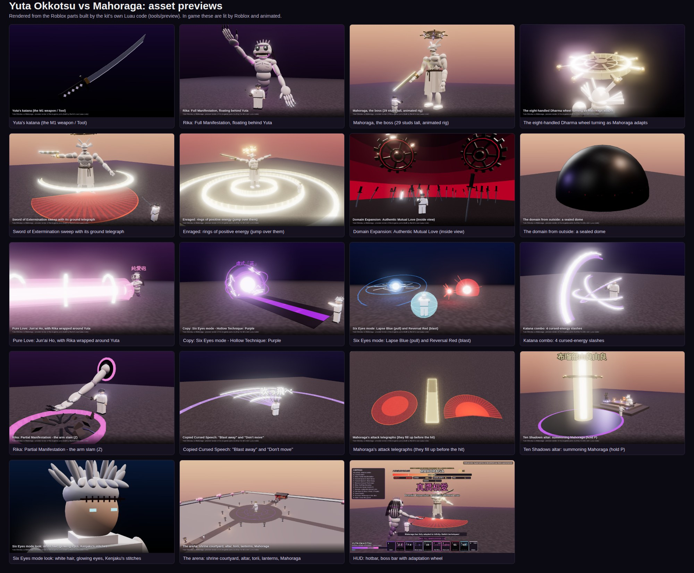

# Yuta Okkotsu vs Mahoraga (Roblox)

A Roblox Studio kit that gives every player Yuta Okkotsu's canon techniques from Jujutsu Kaisen and adds a
Mahoraga raid boss that adapts to whatever you hit it with. Everything (models, effects, UI, arena) is built
from plain Roblox parts in Luau, so there are no meshes to upload and no asset IDs that can break.



## Install

**Fastest: open the place file.** Download [`build/YutaVsMahoraga.rbxlx`](build/YutaVsMahoraga.rbxlx), open
it in Roblox Studio and press **Play**. The arena, altar, dummies and lighting build themselves when the
server starts. Mahoraga is summoned automatically 25 seconds after you spawn, or hold **P** at the altar.

**Add it to your own game.** Open the place file, then copy these three objects into the same places in your
game:

| Object | Put it in |
| --- | --- |
| `JJKShared` (Folder) | `ReplicatedStorage` |
| `JJKServer` (Script) | `ServerScriptService` |
| `JJKClient` (LocalScript) | `StarterPlayer > StarterPlayerScripts` |

Then in `JJKShared > Config` set `World.BuildArena = false` (and `SetupLighting = false` if you have your
own lighting), and set `World.AltarPosition` / `World.BossSpawnPosition` to spots in your map.

**Rojo users.** `rojo serve default.project.json` (or `rojo build -o place.rbxlx`).

## Yuta's techniques

| Key | Technique | What it does |
| --- | --- | --- |
| Click | Katana combo | 4-hit cursed-energy sword combo; the 4th hit launches. |
| Q | Cursed Dash | Fast dash with a short dodge window against Mahoraga. |
| Z | Rika: Partial Manifestation | Rika's arm tears out of a portal behind Yuta and slams the ground ahead. |
| X | Copy: Cursed Speech "Don't move" (動くな) | Stuns every enemy nearby, interrupts Mahoraga's attacks. Costs Yuta a little health (throat backlash). |
| C | Copy: Cursed Speech "Blast away" (吹っ飛べ) | Cone that launches enemies. Throat backlash. |
| V | Reverse Cursed Technique | Heals Yuta and nearby allies, clears stuns. |
| F | Rika: Full Manifestation | Rika fully manifests and floats behind Yuta: +25% damage, claws enemies on her own, absorbs 25% of damage, unlocks R. |
| R | Pure Love: Jun'ai Ho (純愛砲) | Needs F. Rika wraps around Yuta and they fire a colossal beam. |
| T | Domain Expansion: Authentic Mutual Love (真贋相愛) | A dome of crimson sky over a field of katanas, each holding a copied technique. Sure-hit every tick on everyone inside (sword rain, Cursed Speech or Rika), traps Mahoraga inside, and your cooldowns recover faster. |
| G | Copy: Body transplant (Six Eyes) | Kenjaku's copied technique moves Yuta into Gojo's body: white hair, Six Eyes, the forehead stitches, passive **Infinity**, and Z/X/C become **Lapse: Blue**, **Reversal: Red** and **Hollow Technique: Purple**. |
| E (hold) | Cursed energy guard | Blocks 55% of blockable damage. |
| H | Controls panel | Show or hide the on-screen control list. |

Every ability is also on the on-screen hotbar, so it works with touch on mobile.

## Mahoraga

*Eight-Handled Sword Divergent Sila Divine General Mahoraga* rises out of a pool of shadow with the Dharma
wheel spinning above its head.

- **Adaptation (canon).** Every technique that hits Mahoraga counts toward adapting to it. After enough hits the
  wheel turns one step, Mahoraga heals a little and takes 25% less damage from that technique. Four turns means
  it is fully adapted and immune. It adapts to **Infinity** too, so Six Eyes mode protects you less the longer
  you lean on it. The boss bar shows every adaptation, so switch techniques.
- **Sword of Extermination.** A wide positive-energy sweep and an overhead cleave that sends a shockwave line
  across the ground (the cleave can't be blocked, dodge it).
- **Brute force.** A three-punch combo, an earth-shaking stomp, a leap slam and a charge.
- **Enraged below 50% health.** Faster, and it releases rings of positive energy that roll outward; jump over
  them. **Below 20%** it adapts even faster.
- **Telegraphs.** Every attack paints its area on the ground first and fills it up just before the hit.
- **Cursed Speech interrupts it** until it adapts to Cursed Speech.

**No instant kills.** A single Mahoraga hit can never deal more than 25% of your max health
(`Boss.MaxHitFraction`), and every hit gives you 0.45 s of immunity to the next one
(`Boss.HitInvulnerability`), so multi-hit attacks can't stack into a one-shot. Mahoraga itself is tougher than
usual: 7,500 health plus 4,000 per extra player, and it heals as it adapts.

## Configuration

Everything is in `src/shared/Config.luau` (`ReplicatedStorage > JJKShared > Config` in Studio):

- `Rules.PvP`: let Yuta players hit each other.
- `Yuta.FullManifestation.Duration` and `Yuta.SixEyes.Duration`: 60 s and 45 s here. In the manga both are
  limited to 5 minutes; set them to `300` for manga-accurate timers.
- Every damage number, cooldown, radius and the boss's health, speed, attacks and adaptation rules.
- `Sounds`: the katana uses Roblox's built-in sword sounds. Paste audio ids from the Creator Store (for example
  `"rbxassetid://123456"`) into the empty entries to give the big techniques sound.

## Canon notes

Canon: Rika's partial and full manifestation, copying Toge Inumaki's Cursed Speech (with the throat backlash),
outputting Reverse Cursed Technique to heal others, Pure Love (JJK 0), Authentic Mutual Love (a field of swords
holding copied techniques), copying Kenjaku's technique to take over Gojo's body with Six Eyes, Infinity, Blue,
Red and Hollow Purple, and Mahoraga's wheel, head wings, Sword of Extermination, adaptation (including to
Infinity) and healing as it adapts. The 5-minute limits are in the manga; the shorter defaults here are for
pacing. Gameplay additions that aren't canon moves: the dash, the guard, the exact numbers, and Mahoraga's
specific attack patterns and positive-energy rings.

## About the preview images

The images in `docs/previews/` are renders of the exact parts the kit's builders create: the preview tool runs
the real Luau builders (and Mahoraga's real animation poses and the real HUD module) headlessly with
[Lune](https://github.com/lune-org/lune), then draws the parts with three.js. They are not Roblox Studio
screenshots: in game, Roblox's lighting, particles, trails and animation make things look different (and move).
The Yuta figure in them is a stand-in; in game you play your own avatar.

Regenerate them with:

```sh
lune run tools/preview/export.luau && lune run tools/preview/hud_export.luau
cd tools/preview && npm install && node render.mjs
```

## How it was checked

- `luau-lsp analyze` in strict mode against the full Roblox API type definitions: no errors.
- `tools/check_props.py`: every property name in dynamic tables (UI builders, particle emitters, tweens) exists
  on its class in Roblox's API dump.
- All asset builders and the HUD run headlessly under Lune, which rejects any invalid property.
- `rojo build` produces the place file.

It has **not** been play-tested inside Roblox Studio (Studio can't run in the environment this was built in), so
treat the first session as a playtest. Things most worth watching: the katana's grip angle
(`Tool.Grip` in `Katana.luau`), Mahoraga's client-side animation, and knockback feel.

## Layout

```
src/shared/      Config, ability list, colours, net helper
src/shared/Assets/  procedural builders: Katana, Rika, Mahoraga, Domain, Arena, SixEyesLook, Effects
src/server/      World (arena, altar, dummies), YutaKit, MahoragaBoss, Combat, FX
src/client/      Input, HUD, VFX + BossVFX, BossAnimator, RikaFollower, CameraFX
tools/           API property checker and the preview renderer
```
